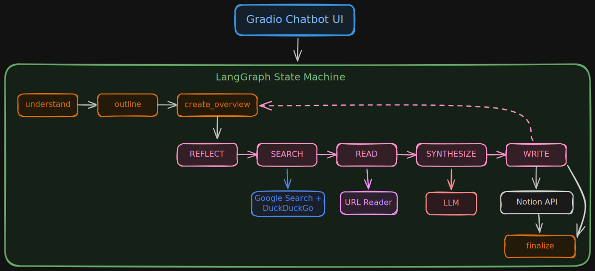

# Project Architect Agent

<div align="center">

[](LICENSE)
[](https://www.python.org/downloads/)
[](https://langchain.com/)
[](https://langchain.com/langgraph)
[](https://developers.notion.com/)

An autonomous research and documentation assistant that transforms project ideas into structured, actionable Notion workspaces using LangChain and LangGraph.

</div>

## Table of Contents

- [Features](#features)
- [Architecture](#architecture)
- [Installation](#installation)
- [Configuration](#configuration)
- [Usage](#usage)
- [Project Structure](#project-structure)
- [How It Works](#how-it-works)
- [Development](#development)
- [Troubleshooting](#troubleshooting)
- [Contributing](#contributing)
- [Acknowledgments](#acknowledgments)
- [License](#license)

## Features

- **Project Analysis**: Automatically extracts project title, objectives, deliverables, and technical domains from your project idea
- **Step Generation**: Breaks down the project into 4-7 actionable implementation steps
- **Automated Research**: Researches each step using web search (Google Custom Search or DuckDuckGo)
- **Content Synthesis**: Uses LLMs (OpenAI-compatible) to synthesize research into structured documentation
- **Notion Integration**: Creates a complete Notion workspace with linked pages for each step
- **Real-time Updates**: Streams progress updates through a Gradio chatbot interface
- **Flexible LLM Support**: Works with OpenAI, Ollama, vLLM, LM Studio, and other OpenAI-compatible APIs

## Architecture

Below is the high-level architecture of Project Architect Agent. You can also open `architecture.excalidraw` in [Excalidraw](https://excalidraw.com) to view and edit the visual diagram.



### Architecture Flow Summary
1. **User Input**: Project idea submitted via Gradio Chatbot UI
2. **State Machine Steps**:
   - `understand`: Extracts project metadata (title, objectives, deliverables)
   - `outline`: Generates 4-7 actionable implementation steps
   - `create_overview`: Creates Notion parent page with project overview
   - `research_loop`: Runs for each step with 5 explicit sub-steps:
     * `REFLECT`: Determine required research for the current step
     * `SEARCH`: Query web via Google Search or DuckDuckGo
     * `READ`: Extract content from top search results via URL Reader
     * `SYNTHESIZE`: Generate structured documentation using LLM
     * `WRITE`: Create detailed Notion page for the step
   - `finalize`: Updates Notion overview with links to all step pages
3. **Tool Integrations**: Explicit connections show which external service is used in each research sub-step.

## Installation

1. Clone the repository:
```bash
git clone https://github.com/yourusername/project_architect_agent.git
cd project_architect_agent
```

2. Create a virtual environment:
```bash
python -m venv venv
source venv/bin/activate  # On Windows: venv\Scripts\activate
```

3. Install dependencies:
```bash
# Option A: Install from requirements.txt
pip install -r requirements.txt

# Option B: Install as editable package (recommended for development)
pip install -e .
```

4. Copy the environment template and configure:
```bash
cp .env.example .env
```

5. Edit `.env` with your API keys (see [Configuration](#configuration) below).

> **Note**: The `.env` file is gitignored and will not be committed to the repository. Use `.env.example` as a template.

## Configuration

### Required Setup

#### LLM Configuration
The agent supports any OpenAI-compatible API:

**For OpenAI:**
```env
OPENAI_API_KEY=sk-...
OPENAI_BASE_URL=https://api.openai.com/v1
OPENAI_MODEL=gpt-4o
OPENAI_TEMPERATURE=0.7
```

**For Ollama (local):**
```env
OPENAI_API_KEY=ollama
OPENAI_BASE_URL=http://localhost:11434/v1
OPENAI_MODEL=llama3.2
OPENAI_TEMPERATURE=0.7
```

**For vLLM / LM Studio / Other:**
```env
OPENAI_API_KEY=your-key-or-dummy
OPENAI_BASE_URL=http://your-server:8000/v1
OPENAI_MODEL=your-model-name
OPENAI_TEMPERATURE=0.7
```

#### Notion Integration
1. Go to [Notion Integrations](https://www.notion.so/my-integrations)
2. Create a new integration
3. Copy the "Internal Integration Secret" (starts with `secret_`)
4. Share a parent page with your integration:
   - Open the page in Notion
   - Click "..." menu → "Connections" → Add your integration
5. Copy the page ID from the URL (the 32-character string after the page name)

#### Google Custom Search (Optional)
1. Create a [Programmable Search Engine](https://programmablesearchengine.google.com/)
2. Enable the Custom Search API in [Google Cloud Console](https://console.cloud.google.com/)
3. Create an API key

If not configured, the agent will use DuckDuckGo as a free alternative.

#### Optional Research Configuration
```env
# Max URLs to read per step (default: 2)
MAX_URLS_PER_STEP=2

# Max search results per query (default: 5)
MAX_SEARCH_RESULTS=5
```

## Usage

### Run the Gradio Interface

```bash
# If installed via requirements.txt
python -m project_architect.main

# If installed as package
project-architect
```

Then open http://localhost:7860 in your browser.

### Example Project Ideas

Try these prompts:
- "Build an AI-powered personal finance tracker that analyzes spending patterns"
- "Create a real-time collaborative whiteboard with video conferencing"
- "Develop an IoT home automation system that learns user preferences"

## Project Structure

```
project_architect_agent/
├── .env.example          # Environment template
├── .gitignore            # Git ignore rules
├── LICENSE               # MIT License
├── pyproject.toml        # Package configuration
├── README.md             # This file
├── requirements.txt      # Dependencies
├── src/
│   └── project_architect/
│       ├── main.py              # Gradio app entry point
│       ├── config/
│       │   └── settings.py      # Environment configuration
│       ├── agent/
│       │   ├── state.py         # LangGraph state schema
│       │   ├── graph.py         # StateGraph definition
│       │   └── nodes/           # Agent node implementations
│       │       ├── understand.py
│       │       ├── outline.py
│       │       ├── create_overview.py
│       │       ├── research_loop.py
│       │       └── finalize.py
│       ├── tools/
│       │   ├── search.py        # Google/DuckDuckGo search
│       │   ├── reader.py        # URL content extraction
│       │   └── notion_client.py # Notion API wrapper
│       └── utils/
│           ├── prompts.py       # LLM prompt templates
│           └── markdown.py      # Output formatting
└── tests/                   # Unit tests
    ├── test_agent.py
    └── test_tools/
        ├── test_notion.py
        ├── test_reader.py
        └── test_search.py
```

## How It Works

### Step 1: Understand Project
The agent analyzes your project idea using an LLM to extract:
- Project title
- Key objectives
- Expected deliverables
- Technical domains (AI, Web, Cloud, etc.)

### Step 2: Outline Steps
Based on the analysis, the agent generates 4-7 actionable implementation steps covering the full project lifecycle.

### Step 3: Create Notion Overview
A main project page is created in Notion with:
- Project objectives
- Deliverables list
- Technical domains
- Step overview

### Step 4: Research Loop (for each step)
For each step, the agent:
1. **REFLECTS** on what information is needed
2. **SEARCHES** the web for recent best practices
3. **READS** the top 1-2 relevant URLs
4. **SYNTHESIZES** findings into structured documentation
5. **WRITES** a detailed Notion page for the step

### Step 5: Finalize
The overview page is updated with links to all step pages, providing easy navigation.

## Development

### Running Tests

```bash
pytest tests/ -v
```

### Code Style

```bash
ruff check src/
ruff format src/
```

### Type Checking

```bash
mypy src/
```

## Troubleshooting

### Notion Integration Issues
- Ensure your integration has access to the parent page (check "Connections" in Notion page settings)
- Verify the `NOTION_PARENT_PAGE_ID` is correct (32-character string from the URL)
- Notion tokens start with `secret_` - ensure you copied the full token

### LLM API Issues
- For Ollama: Ensure the service is running (`ollama serve`)
- For OpenAI: Verify your API key has sufficient credits
- Check `OPENAI_BASE_URL` matches your API endpoint

### Search Issues
- If Google Search fails, the agent automatically falls back to DuckDuckGo
- Rate limits may apply to Google Custom Search (100 queries/day free limit)
- Some websites block automated content extraction

### Other Issues
- Check `app.log` for detailed error messages
- Ensure all required environment variables are set in `.env`

## Contributing

Contributions are welcome! Please follow these steps:

1. Fork the repository
2. Create a new branch (`git checkout -b feature/your-feature`)
3. Make your changes
4. Run tests and linting (`pytest && ruff check src/ && ruff format src/`)
5. Commit your changes (`git commit -m 'Add some feature'`)
6. Push to the branch (`git push origin feature/your-feature`)
7. Open a Pull Request

## Acknowledgments

- [LangChain](https://github.com/langchain-ai/langchain) - LLM framework
- [LangGraph](https://github.com/langchain-ai/langgraph) - State machine framework
- [Notion API](https://developers.notion.com/) - Workspace integration
- [Gradio](https://gradio.app/) - UI framework
- [DuckDuckGo Search](https://github.com/deedy5/duckduckgo_search) - Fallback search

## License

This project is licensed under the MIT License - see the [LICENSE](LICENSE) file for details.
